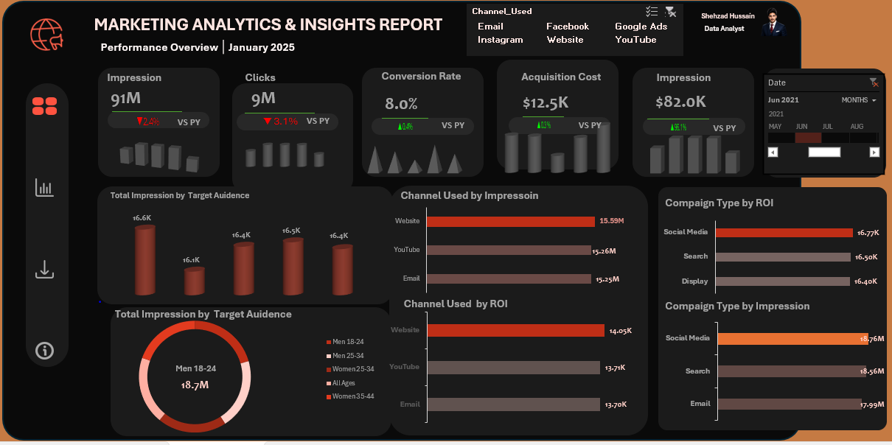
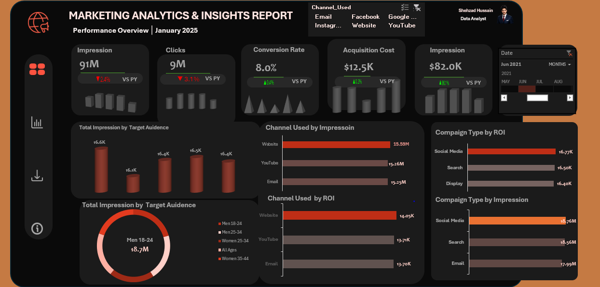

# 📊 Marketing Analytics & Insights Report — Excel Dashboard

  

  
  
  
  
  

---

## 🖼️ Dashboard Preview

  

> 🎯 **Performance Overview | January 2025**
> Built entirely in **Microsoft Excel** with interactive slicers,
> dynamic KPI cards, sparklines, and multi-channel marketing analysis.

---

## 📌 Project Overview

This **Marketing Analytics & Insights Dashboard** is a fully interactive
Excel-based reporting solution designed to track, visualize, and analyze
digital marketing performance across **6 major channels** —
Email, Facebook, Google, Instagram, Website, and YouTube.

The dashboard delivers a **complete performance overview for January 2025**,
enabling marketers and business stakeholders to make fast, data-driven
decisions through dynamic filtering, year-over-year comparisons, and
audience segmentation insights — all within Microsoft Excel.

---

## 🎯 Objectives

- ✅ Centralize all digital marketing KPIs in one interactive dashboard
- ✅ Track performance vs Prior Year (PY) for trend awareness
- ✅ Identify the most effective marketing channels by Impressions and ROI
- ✅ Segment audience data by demographics (age group & gender)
- ✅ Compare campaign type performance — Social Media, Search, Display
- ✅ Enable dynamic filtering by Channel and Date using Excel Slicers
- ✅ Support data-driven budget allocation and strategy decisions

---

## 📈 Key KPIs & Metrics

| 📊 Metric | 📅 Jan 2025 Value | 📉📈 VS Prior Year |
|---|---|---|
| 👁️ **Total Impressions** | 91 Million | 🔴 -2.4% |
| 🖱️ **Total Clicks** | 9 Million | 🔴 -3.1% |
| 🔄 **Conversion Rate** | 8.0% | 🟢 +0.4% |
| 💰 **Acquisition Cost** | $12.5K | 🟢 Improved +0.3% |
| 💵 **Revenue / Impression** | $82.0K | 🟢 +61% |
| 🌐 **Top Channel — Impressions** | Website (15.59M) | — |
| 💹 **Top Channel — ROI** | Website ($14.05K) | — |
| 🏆 **Top Campaign — ROI** | Social Media ($16.77K) | — |
| 👥 **Largest Audience Segment** | Men 18–24 (18.7M) | — |

---

## 🔍 Key Insights

> 📊 Data-driven findings extracted from the January 2025 dashboard:

- 📉 **Impressions fell 2.4% vs Prior Year** — Total reach dropped to 91M,
  suggesting reduced ad spend or increased market competition.
  A channel mix review is recommended.

- 📉 **Clicks declined 3.1% vs Prior Year** — Lower click volume signals
  potential creative fatigue or audience targeting drift.
  A/B testing of ad creatives is advised.

- 📈 **Conversion Rate improved +0.4%** — Despite lower traffic volume,
  more visitors are converting, indicating better landing page performance
  or improved audience targeting quality.

- 🚀 **Revenue/Impression surged +61% vs Prior Year** — The most impressive
  YoY gain, showing that monetization efficiency has dramatically improved
  even as raw impression volume declined.

- 🌐 **Website is the #1 channel** for both Impressions (15.59M) and
  ROI ($14.05K) — confirming it as the highest-value marketing channel
  deserving continued investment.

- 📱 **Social Media campaigns lead in ROI ($16.77K)** — outperforming
  Search ($16.50K) and Display ($16.40K) campaigns, making it the most
  cost-efficient campaign type.

- 👨 **Men aged 18–24 are the dominant segment (18.7M impressions)** —
  This demographic should be the primary audience for future high-budget
  campaigns and creative strategy.

---

## 📊 Dashboard Features & Visuals

| 🎨 Feature | 📋 Description |
|---|---|
| 🎛️ **Channel Slicer** | Filter by Email, Facebook, Google, Instagram, Website, YouTube |
| 📅 **Date Timeline Slicer** | Interactive monthly/yearly date range filter |
| 📊 **KPI Cards (×5)** | Impressions, Clicks, Conversion Rate, Acquisition Cost, Revenue |
| 📉 **Sparkline Charts** | Mini trend lines embedded inside each KPI card |
| 🟢🔴 **YoY Indicators** | Color-coded arrows showing Prior Year comparison |
| 📊 **Clustered Bar Chart** | Total Impressions by Target Audience segment |
| 🍩 **Donut / Ring Chart** | Audience share breakdown by age & gender group |
| 📊 **Horizontal Bar — Channels** | Impressions & ROI per marketing channel |
| 📊 **Horizontal Bar — Campaigns** | ROI & Impressions by campaign type |
| 🎨 **Dark Mode Design** | Professional dark theme with orange/red accent colors |

---

## 🛠️ Tools & Technologies

  
  
  
  
  

| 🛠️ Tool / Feature | 🎯 How It Was Used |
|---|---|
| **Microsoft Excel** | Full dashboard design and development |
| **Pivot Tables** | Data aggregation by channel, campaign, audience |
| **Excel Slicers** | Interactive Channel and Date filters |
| **Sparklines** | Mini trend charts inside KPI metric cards |
| **Conditional Formatting** | Red 🔴 / Green 🟢 YoY performance indicators |
| **Bar & Donut Charts** | Channel, campaign, and audience visualizations |
| **Named Ranges** | Clean formula referencing across the workbook |
| **Dark Theme Design** | Custom formatting for professional visual impact |

---

## 📁 Project Structure
